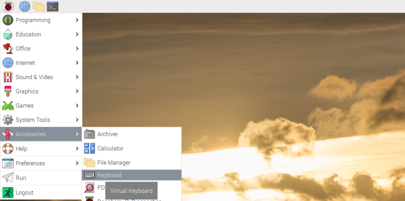

# Virtual Keyboard Layout

This repository content is the virtual keyboard layout file and the buttons' images. The layout is program matchbox-keyboard configuration file. The data is in XML format. It is the 85 keys keyboard (Main, Function Keys and NumPad) layout with 4 languages symbols (see image #1).


## Program

The **matchbox-keyboard** is the virtual (on screen) keyboard program for the Raspberry Pi.

The original program's repository is https://github.com/mwilliams03/matchbox-keyboard

## Virtual Keyboard setting up

Info: https://pimylifeup.com/raspberry-pi-on-screen-keyboard/


### Install

Launch the Terminal and input commands:

```
sudo apt-get update
sudo apt-get upgrade
sudo apt-get install matchbox-keyboard
```

Additional info: *how to run a command without hitting enter key*
https://unix.stackexchange.com/questions/52055/how-to-run-a-command-without-hitting-enter-key/52110#52110

y and Enter combination, copy and paste to the Terminal:
```
y-> "

"
```

### Lauch

1. Once you are on the desktop of your Raspberry Pi, click the icon in the top-left hand corner of the screen.
2. Hover over “Accessories”, this will bring up an additional menu.
3. Within this new menu, click “Keyboard” to launch the program (see image #2)



### Keyboard launcher

1. Create new shell file. Input command in the Terminal:

```
sudo nano /usr/bin/toggle-keyboard.sh
```

   Type text in text editor nano:

```
#!/bin/bash
PID="$(pidof matchbox-keyboard)"
if [  "$PID" != ""  ]; then
  kill $PID
else
  matchbox-keyboard &
fi
```

2. Change execution permisions. Input command in the Terminal:

```
sudo chmod +x /usr/bin/toggle-keyboard.sh
```

3. Create new desktop file in application directory. Input command in the Terminal:

```
sudo nano /usr/share/raspi-ui-overrides/applications/toggle-keyboard.desktop
```

Type text in text editor nano:

```
[Desktop Entry]
Name=Toggle Virtual Keyboard
Comment=Toggle Virtual Keyboard
Exec=/usr/bin/toggle-keyboard.sh
Type=Application
Icon=matchbox-keyboard.png
Categories=Panel;Utility;MB
X-MB-INPUT-MECHANISM=True
```

4. Copy the panel file to user configuration. Input command in the Terminal:
```
cp /etc/xdg/lxpanel/LXDE-pi/panels/panel ~/.config/lxpanel/LXDE-pi/panels/panel
```

Edit this file. Input command in the Terminal:

```
nano ~/.config/lxpanel/LXDE-pi/panels/panel
```

Add text in the end of file. Type text in text editor nano:

```
Plugin {
  type=space
  Config {
    Size=2
  }
}
Plugin {
  type=launchbar
  Config {
    Button {
      id=toggle-keyboard.desktop
    }
  }
}
Plugin {
  type=space
  Config {
    Size=2
  }
}
```

5. Reboot system.
Input command in the Terminal:

```
sudo reboot
```

After reboot you will see the Toggle Virtual Keyboard icon near the Clock (see image #3).


## Virtual Keyboard Layouts

The default keyboard layout is only letter keys QWERTY, Backspace, Enter and Shift key. To change layout you need other configuration file in XML format. You can find some example layouts at /usr/share/matchbox-keyboard/ Copy configuration file into user home folder .matchbox (~/.matchbox)

### Change Layout

Info: https://stackoverflow.com/questions/70574505/how-to-change-the-default-matchbox-keyboard-layout

1. Download the repository files into Downloads folder (~/Downloads/virtual_keyboard_layout)

2. Input command in the Terminal:

```
mkdir ~/.matchbox
cp ~/Downloads/virtual_keyboard_layout/keyboard_qwerty_85keys.xml ~/.matchbox/keyboard.xml
```

3. Copy arrows' images in /usr/share/machbox-keyboard . Input command in the Terminal:

```
sudo cp ~/Downloads/virtual_keyboard_layout/img/arrow_*.png /usr/share/machbox-keyboard/
```

4. Launch virtual keyboard.


## Layout description

85 keys keyboard layout with 4 languages symbols
Main, Function Keys and NumPad (see image #4)

This layout is based on the topic described keyboard layouts https://forums.raspberrypi.com/viewtopic.php?t=325579

### Main keys


### Latvian language symbols (mod2):

The Latvian language layout based on the base-fragment-lv_LV.xml layout file.
Full path is /usr/share/matchbox-keyboard/base-fragment-lv_LV.xml

|   |   |   |   |   |   |   |   |   |   | Description |
|:-:|:-:|:-:|:-:|:-:|:-:|:-:|:-:|:-:|:-:|:-----------:|
| q | w | e | r | t | y | u | i | o | p |  main keys  |
| Ū | ū | Ē | ē | Č | č | Ž | ž | Ķ | ķ |             |
|   |   |   |   |   |   |   |   |   |   |             |
| a | s | d | f | g | h | j | k | l |   |             |
| Š | š | Ģ | ģ | Ņ | ņ | Ī | ī | ¸ |   |             |
|   |   |   |   |   |   |   |   |   |   |             |
| z | x | c | v | b | n | m |   |   |   |             |
| Ā | ā | Ļ | ļ | ˆ | ˋ | ˇ |   |   |   |             |
|   |   |   |   |   |   |   |   |   |   |             |

To show latvian language keys press cp key.


### Russian language symbols (mod3):

The Russian language layout based on the base-fragment-ru_RU.xml layout file. Full path is /usr/share/matchbox-keyboard/base-fragment-ru_RU.xml

|      |      |       |     |   |   |   |   |       |   |   |   | Description |
|:----:|:----:|:-----:|:---:|:-:|:-:|:-:|:-:|:-----:|:-:|:-:|:-:|:-----------:|
| q    | w    |  e    | r   | t | y | u | i |  o    | p | { | } |             |
| й    | ц    |  у    | к   | е | н | г | ш |  щ    | з | х | ъ |             |
|      |      |       |     |   |   |   |   |       |   |   |   |             |
| a    | s    |  d    | f   | g | h | j | k |  l    | ; | ' |   |             |
| ф    | ы    |  в    | а   | п | р | о | л |  д    | ж | э |   |             |
|      |      |       |     |   |   |   |   |       |   |   |   |             |
| z    | x    |  c    | v   | b | n | m | , |  .    |   |   |   |             |
| я    | ч    |  с    | м   | и | т | ь | б |  ю    |   |   |   |             |
|      |      |       |     |   |   |   |   |       |   |   |   |             |
| 1    | 2    |  3    | 4   | 5 | 6 | 7 | 8 |  9    | 0 | - |   |  main keys  |
| Й    | Ц    |  У    | К   | Е | Н | Г | Ш |  Щ    | З | Х |   |             |
|      |      |       |     |   |   |   |   |       |   |   |   |             |
| Bksp | Home | PgUp  | 7   | 8 | 9 | ÷ |   |       |   |   |   | Keys/NumPad |
| Ф    | Ы    |  В    | А   | П | Р | О |   |       |   |   |   |             |
|      |      |       |     |   |   |   |   |       |   |   |   |             |
| \    | End  | PgDn  | 4   |   |   |   |   |       |   |   |   |             |
| Л    | Д    |  Ж    | Э   |   |   |   |   |       |   |   |   |             |
|      |      |       |     |   |   |   |   |       |   |   |   |             |
| 6    | ×    | Enter | Del | 1 | 2 | 3 | - | Shift |   |   |   | NumPad/Keys |
| Я    | Ч    |  С    | М   | И | Т | Ь | Б |  Ю    |   |   |   |             |
|      |      |       |     |   |   |   |   |       |   |   |   |             |

To show russian language keys press ё key.


### Greek language's alphabet fragment and other symbols

Greek language symbols is in NumPad keyboard (mod2) and other mode keys

NumPad:

01 23 4567 89 ÷×+=.   num pad mode

⁰1 23 4567 89 ρׯ⁺~.  fn mode (mod1)

₀α βγ δΔθλ μω Ωπ₋₊→∫  lang1 mode (mod2)

∞en↓pd←5→ho↑pu≤≥_±≠√  Shift(Caps lock) mode en-end, pd-page down, ho-home, pu-page up

To show greek language keys press cp key (see image above #5).

To show function keys press fn key (see image #7).


To show other symbols press Shift key (see image #8).


## Change locale
Info: https://forums.raspberrypi.com/viewtopic.php?t=49468

https://wiki.debian.org/Locale

1. sudo raspi-config
2. select Localisation options
3. select Locale
4. in Package configuration check your country language and english packages
5. select your country as default
6. change /etc/locale/default to:
LANG=lv_LV.UTF-8
LANGUAGE=en_US.UTF-8
LC_ALL=lv_LV.UTF-8
or if you want to choose other settings run command:
locale
and copy other options to /etc/locale/default
7. sudo locale-gen
8. sudo reboot 