# Change locale
Info: *How to set local locale with english text?* https://forums.raspberrypi.com/viewtopic.php?t=49468

Run terminal. Input commands.

1. sudo raspi-config
2. select Localisation options

image #1
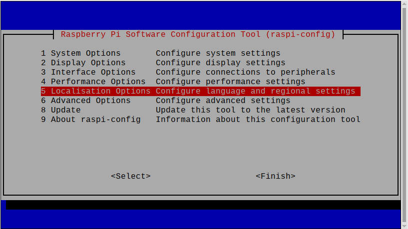

3. select Locale

image #2
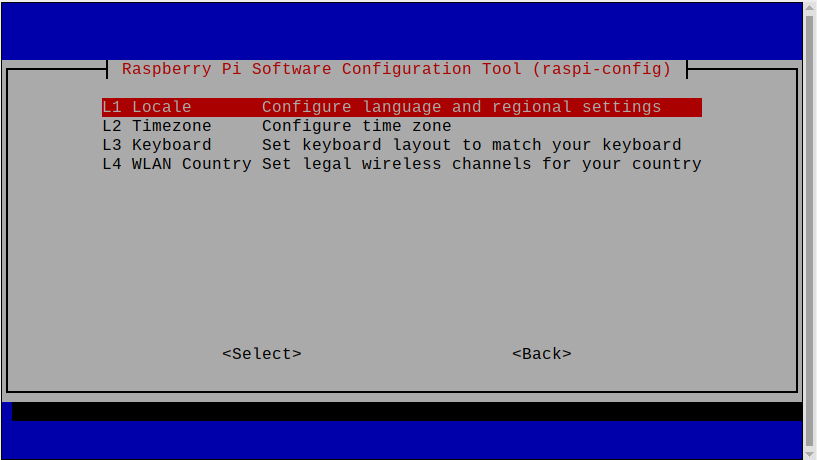


4. in Package configuration check english and your country language packages (e.g. lv_LV.)

image #3


and

image #4
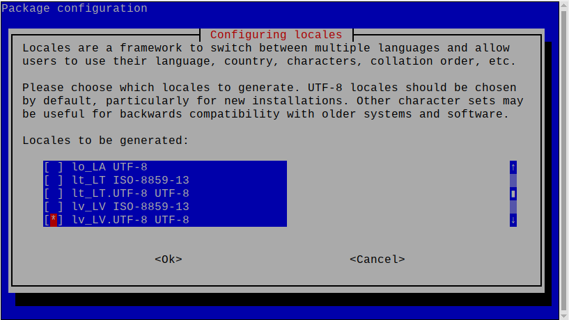


5. select your country as default

image #5
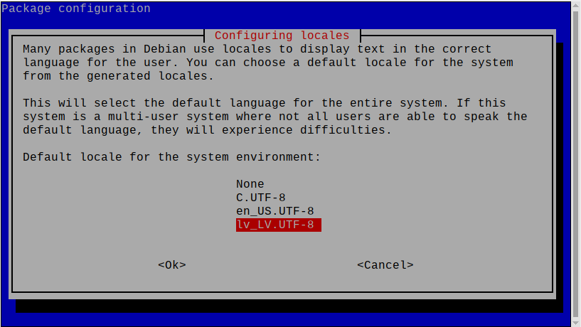

6. press Finish button

image #6
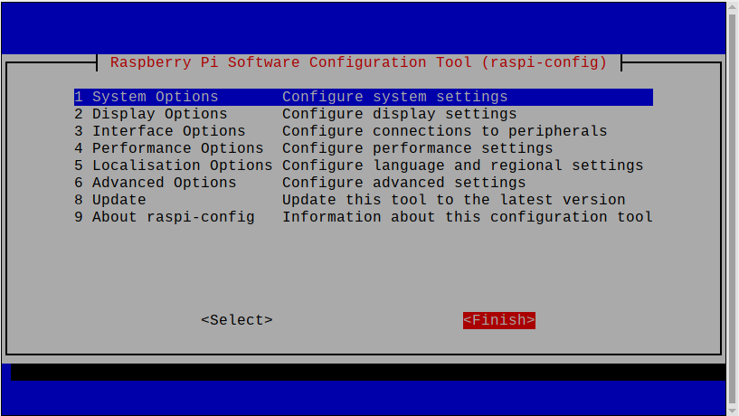


7. change /etc/default/locale to:

```
LANG=lv_LV.UTF-8
LANGUAGE=en_US.UTF-8
LC_ALL=lv_LV.UTF-8
```

image #7
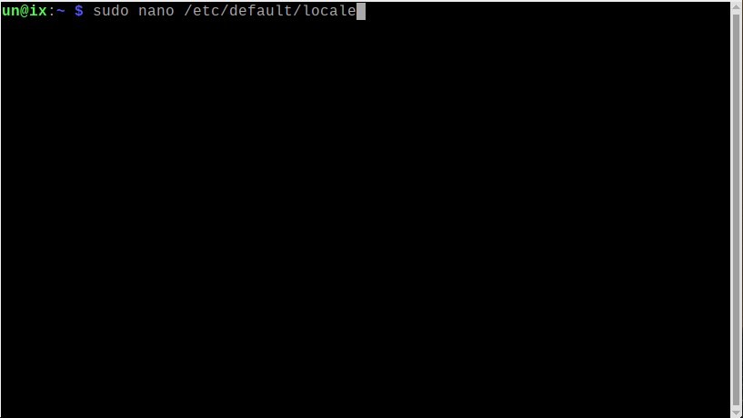

image #8
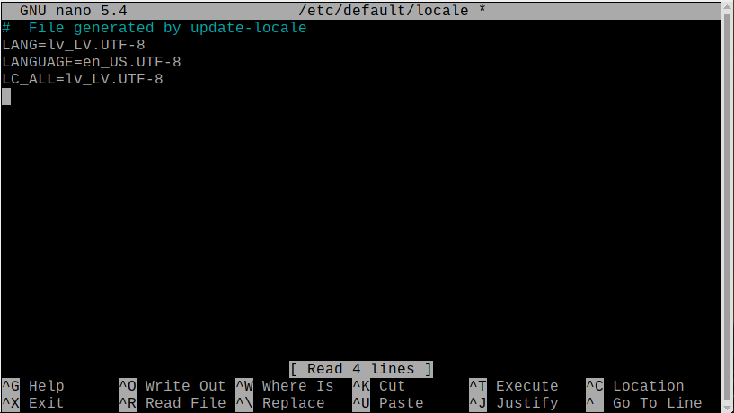

or if you want to choose other settings replace LC_ALL row with other rows. Run command:

```
locale
```

and copy other options into /etc/default/locale

image #9
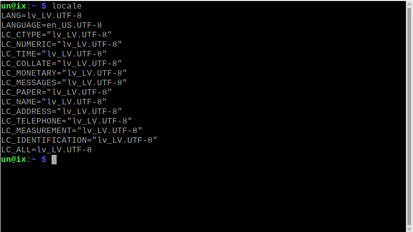

Info: *Locale* https://wiki.debian.org/Locale

8. sudo locale-gen

image #10
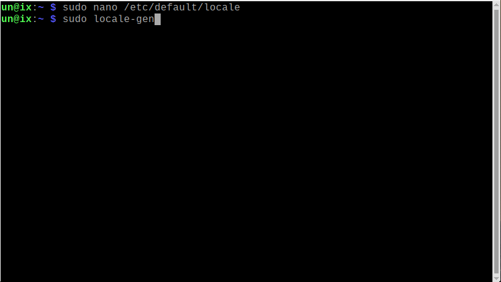

image #11
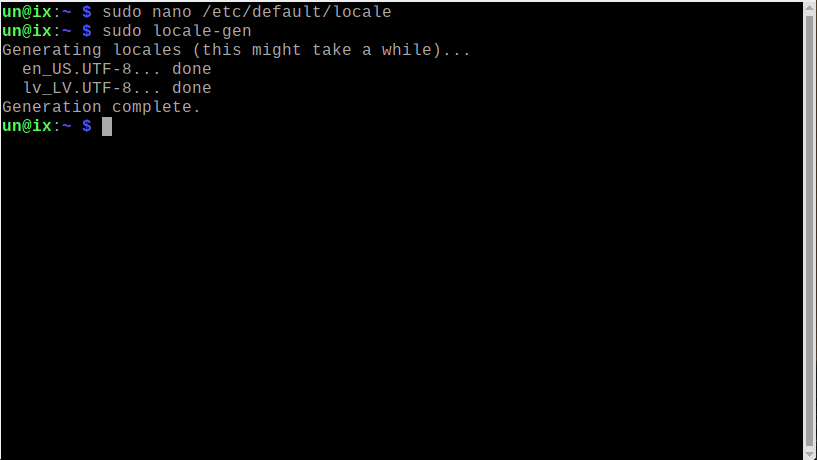

9. sudo reboot

image #12
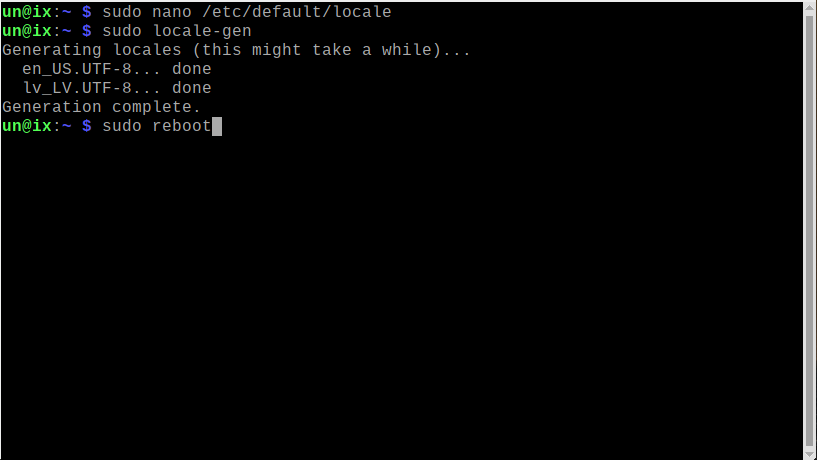

EOF